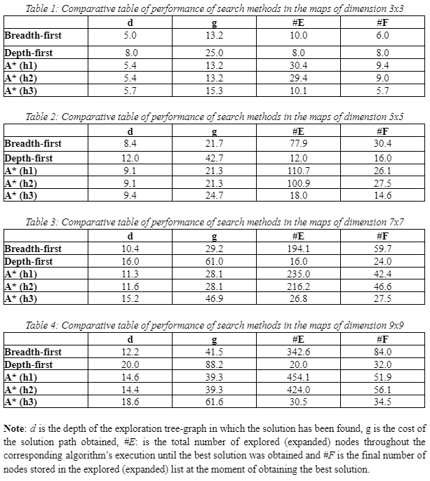
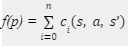

Search Algorithms for a Drill Robot
===

This project focuses on implementing and comparing various search algorithms for navigating a drill robot in a grid world. The drill robot's goal is to find the most efficient path from a starting point to a target location, avoiding obstacles and exploring the grid effectively.

## Grid World Description
The grid world is a two-dimensional array where each cell represents a possible position for the drill robot. The grid includes:

- Start Position: The initial position of the robot.
- Target Position: The goal position the robot needs to reach.
- Obstacles: Cells that the robot cannot traverse.
- Free Cells: Navigable cells where the robot can move with a cost associated.

## Results comparison



## Project Structure
The project is organized as follows:

```
├── aima
│   ├── search.py
│   ├── utils.py 
├── maps
├── src
│   ├── actions.py
│   ├── drillrobot.py
│   ├── evaluator.py
│   ├── filereader.py
│   ├── filewriter.py
│   ├── heuristic_functions.py
│   ├── miningproblem.py
│   ├── shared.py
│   ├── state.py
```

## Dependencies
The main libraries used in this project include:

- [AIMA-Python](https://github.com/aimacode/aima-python)
- NumPy

## Formal characterization of the problem
The problem can be defined as a state space search represented by a four-tuple (S, A, I, G), where:
- S is the state space. It represents all the possible states in the problem.
- A is the set of arcs (or links) between nodes. These correspond to the operators/actions.
- I is a nonempty subset of S. It represents the start (init) state(s) i of the problem.
- G is a nonempty subset of S. It represents the goal state(s) g of the problem.

### Representation of the state:
Given a particular state s from the set of possible states S, this state can be defined as:

```
s = {IN(position), TOWARDS(orientation)}
```

where position provides a pair of coordinates (x, y) representing the row and column respectively in the matrix coding of the terrain map in which the robot is located, and orientation represents the robot’s orientation, which can be {0:‘North’, 1:‘Northeast’, 2:‘East’, 3:‘Southeast’, 4:‘South’, 5:‘Southwest’, 6:‘West’ or 7:‘Northwest’} .

### Specification of the available set of operators (actions of the robot):  
ACTIONS(s) returns a nonempty subset of A corresponding to the set of actions/operators that can be executed in s. We say that each of APPLICABLE these actions is applicable in s. 

The applicable actions are:

```
ACTIONS(s) = {MoveForward(s), Clockwise(s), Counterclockwise(s)}
```

### The transition model (possible set of preconditions and the result of each action):  
RESULT(s, a) returns the state that results from SUCCESSOR doing action a in state s. The possible set of preconditions corresponds with the actual orientation of the robot.

#### Transition model of action MoveForward
```
TOWARDS(North), RESULT(s,MoveForward(s)) = {IN(s.position.x - 1, s.position.y), TOWARDS(North)}
TOWARDS(Northeast), RESULT(s,MoveForward(s)) = {IN(s.position.x - 1, s.position.y + 1), TOWARDS(Northeast)}
TOWARDS(East), RESULT(s,MoveForward(s)) = {IN(s.position.x, s.position.y + 1), TOWARDS(East)}
TOWARDS(Southeast), RESULT(s,MoveForward(s)) = {IN(s.position.x + 1, s.position.y + 1), TOWARDS(Southeast)}
TOWARDS(South), RESULT(s,MoveForward(s)) = {IN(s.position.x + 1, s.position.y), TOWARDS(South)}
TOWARDS(Southwest), RESULT(s,MoveForward(s)) = {IN(s.position.x + 1, s.position.y - 1), TOWARDS(Southwest)}
TOWARDS(West), RESULT(s,MoveForward(s)) = {IN(s.position.x, s.position.y - 1), TOWARDS(West)}
TOWARDS(Northwest), RESULT(s,MoveForward(s)) = {IN(s.position.x - 1,s.position.y - 1), TOWARDS(Northwest)}
```

#### Transition model of action Clockwise
```
TOWARDS(North), RESULT(s, Clockwise(s)) = {IN(s.position), TOWARDS(Northeast)}
TOWARDS(Northeast), RESULT(s, Clockwise(s)) = {IN(s.position), TOWARDS(East)}
TOWARDS(East), RESULT(s, Clockwise(s)) = {IN(s.position), TOWARDS(Southeast)}
TOWARDS(Southeast), RESULT(s, Clockwise(s)) = {IN(s.position), TOWARDS(South)}
TOWARDS(South), RESULT(s, Clockwise(s)) = {IN(s.position), TOWARDS(Southwest)}
TOWARDS(Southwest), RESULT(s, Clockwise(s)) = {IN(s.position), TOWARDS(West)}
TOWARDS(West), RESULT(s, Clockwise(s)) = {IN(s.position), TOWARDS(Northwest)}
TOWARDS(Northwest), RESULT(s, Clockwise(s)) = {IN(s.position), TOWARDS(North)}
```

#### Transition model of action Counterclockwise
```
TOWARDS(Northwest), RESULT(s, Counterclockwise(s)) = {IN(s.position), TOWARDS(West)}
TOWARDS(West), RESULT(s, Counterclockwise(s)) = {IN(s.position), TOWARDS(Southwest)}
TOWARDS(Southwest), RESULT(s, Counterclockwise(s)) = {IN(s.position), TOWARDS(South)}
TOWARDS(South), RESULT(s, Counterclockwise(s)) = {IN(s.position), TOWARDS(Southeast)}
TOWARDS(Southeast), RESULT(s, Counterclockwise(s)) = {IN(s.position), TOWARDS(East)}
TOWARDS(East), RESULT(s, Counterclockwise(s)) = {IN(s.position), TOWARDS(Northeast)}
TOWARDS(Northeast), RESULT(s, Counterclockwise(s)) = {IN(s.position), TOWARDS(North)}
TOWARDS(North), RESULT(s, Counterclockwise(s)) = {IN(s.position), TOWARDS(Northwest)}
```
### Goal test:
Determines whether a given state s is a goal state g:

```
s == {IN(g.position), TOWARDS(g.orientation)}
```

### Cost function:
The cost of a path can be described as the sum of the costs of the individual actions along the path.

STEP COST: The step cost of taking action a in state s to reach state s is denoted by c(s, a, s’). The hardness of the subsoil rock at each location in the matrix coding of the terrain map represents the value of each state.

```
c(s, MoveForward(s), s’) = s’.value
c(s, Clockwise(s), s’) = 1
c(s, Counterclockwise(s), s’) = 1
```

Thus, the cost function for a path p of n steps can be defined as the following:



## Search Algorithms
- Breadth-First Search (BFS)

BFS is an uninformed search algorithm that explores all the neighbor nodes at the present depth level before moving on to nodes at the next depth level. It guarantees finding the shortest path in an unweighted grid.

- Depth-First Search (DFS)

DFS is an uninformed search algorithm that explores as far as possible along each branch before backtracking. It does not guarantee the shortest path but can be more memory efficient.

- A* Search

A* Search is an informed search algorithm that uses both the actual cost from the start node and a heuristic to estimate the cost to the goal. It is efficient and guarantees the shortest path if the heuristic is admissible.